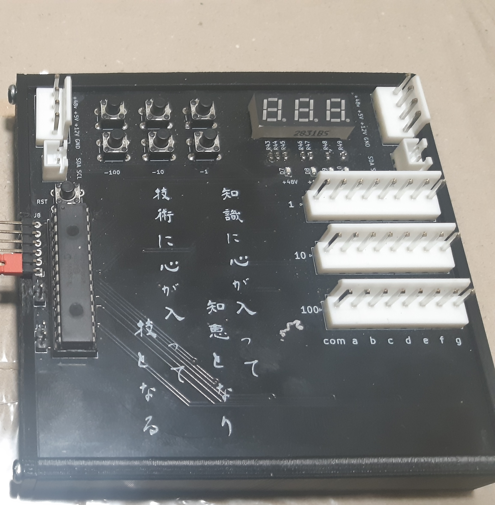
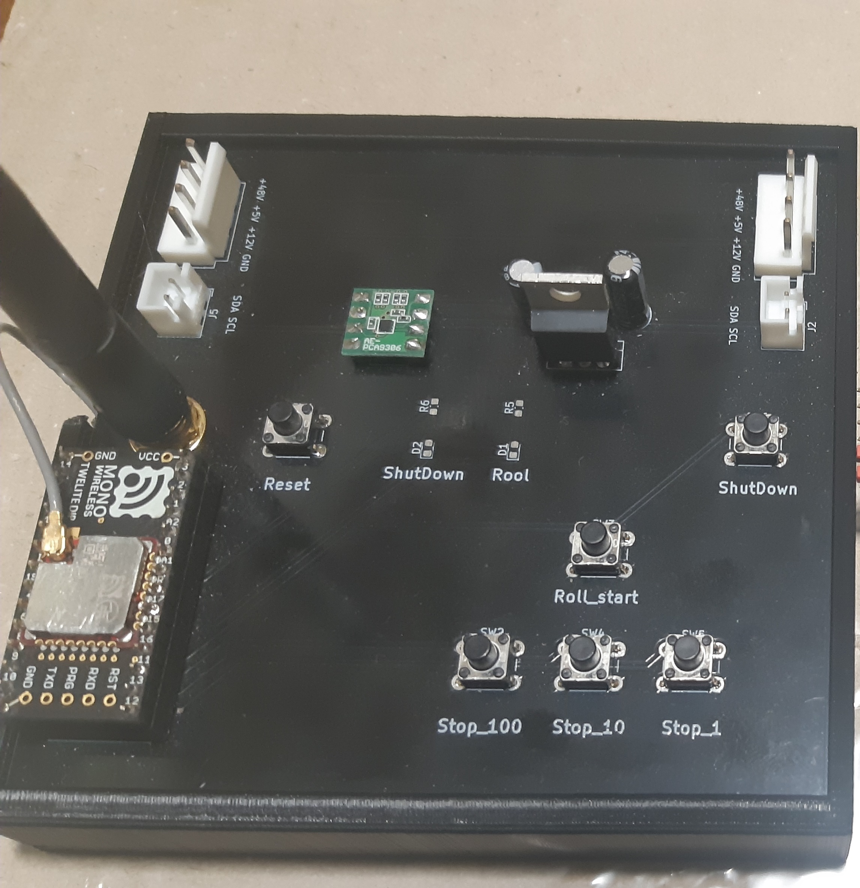
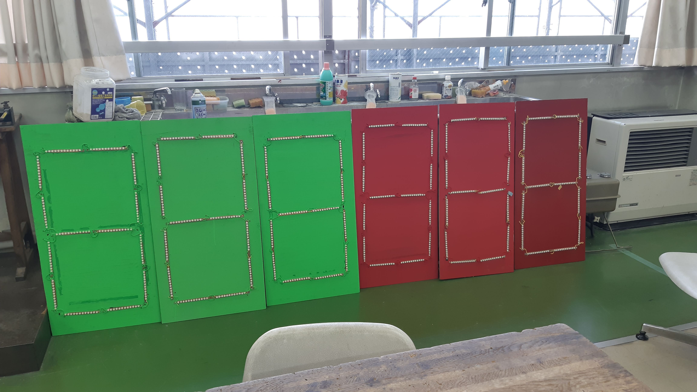
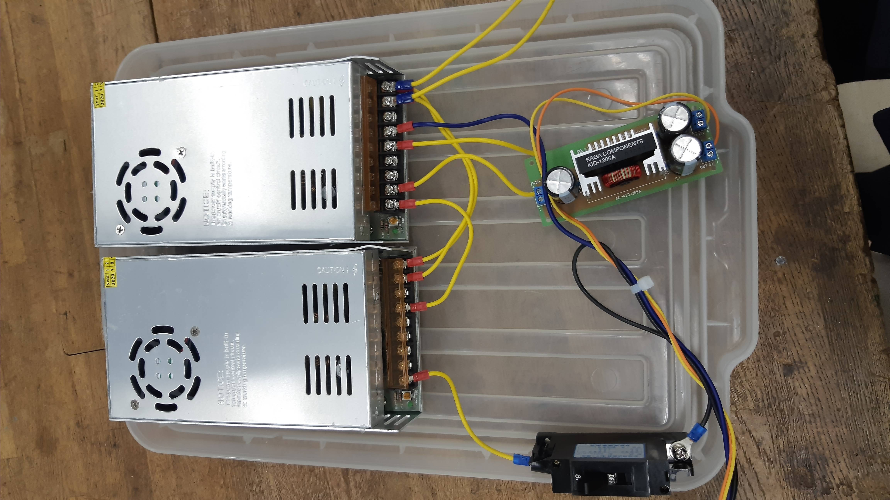
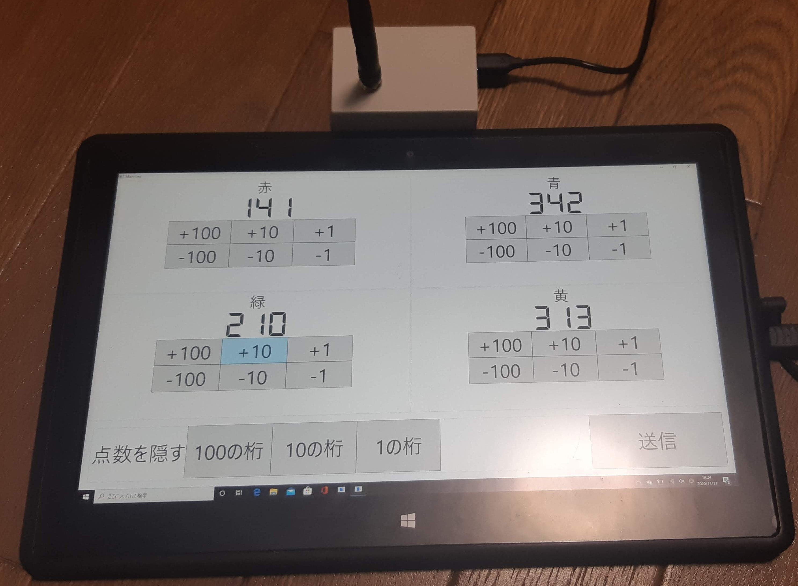
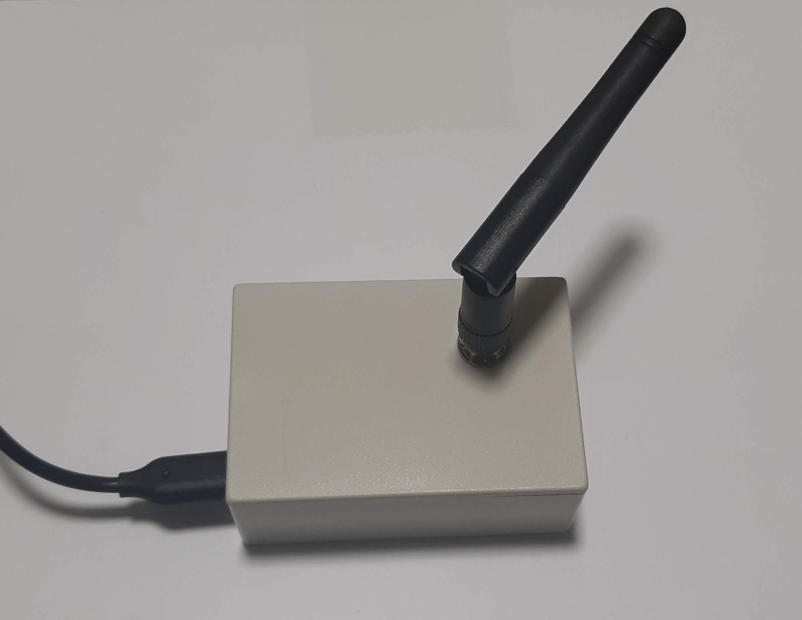
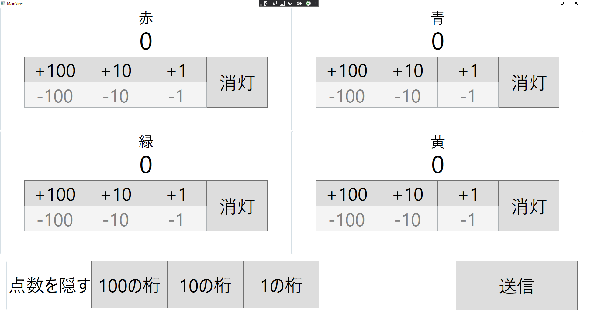
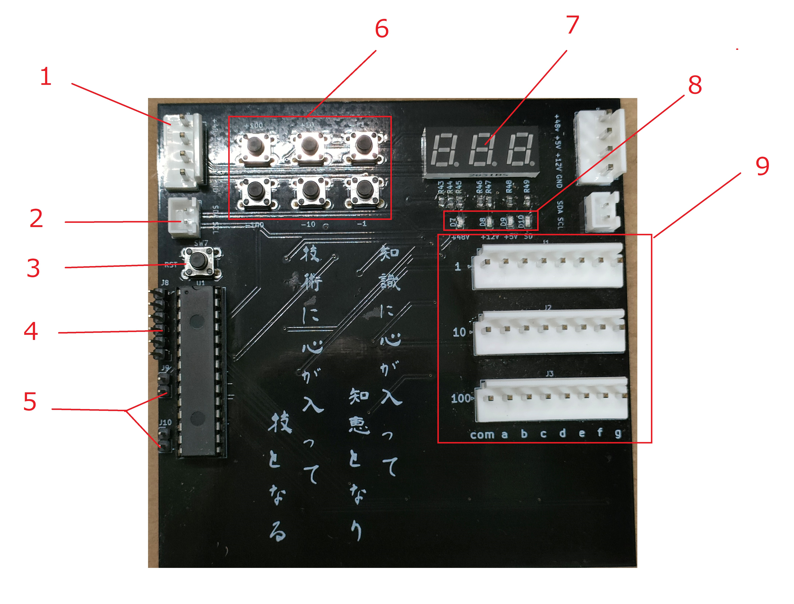

# LED得点掲示板
## 目次
1. [必要な物](#anchor_needthings)
2. [構成図](#anchor_diagram)
3. [点検](#anchor_inspection)
4. [操作説明](#anchor_operation)
5. [Q&A](#anchor_Q&A)


<a id="anchor_needthings"></a>

## 必要なもの
* メイン基板 x 4

* 通信基盤 x 4

* LEDパネル3枚 x 4色(計12枚)

* 電源装置

* 電源ケーブル 2本
* 通信ケーブル 4本
* 操作用タブレッド(画像は旧型のタブレッドです)

* 送信機
 

<a id="anchor_diagram"></a>

## 構成図
  


## 点検
* 電源装置
+48V,+12V,+5Vが正しい電圧を出力しているかをテスターで確認してください
+48V電源を出力するにはブレーカーを「ON」に切り替える必要があります。また、電圧を確認したらブレーカーは必ず「OFF」に戻してください。
<<**注意+48Vとは最大が48Vであるというこのなので、実際に点灯させる場合は36Vあたりから必要な明るさになるまで電圧をあげてください**>>

* メイン基板
電源装置の+48Vブレーカーが「OFF」であることを確認してから、メイン基板に電源コードを接続します。基板上の7セグLEDが点灯し、ボタンで点数を操作することができることを確認してください。次にLEDパネルのコネクタ3本をメイン基板に接続してください。電源装置の+48Vブレーカーを「ON」に切り替え、LEDが点灯したら正常です。点灯を確認したらブレーカーは必ず「OFF」に戻してください。

* 操作用タブレッド
タブレッドに通信機をUSB接続してから操作用ソフト「ScoreBoard2」が実行できることを確認してください。ソフトを起動できない場合は[COMポートの設定]()を参照してください。

* 通信基板
通信基板に電源ケーブル接続し、隣り合うメイン基板と通信ケーブルで接続してください。
前述した操作用タブレッドで起動済みのソフトにて得点を入力してから「送信」ボタンを押してメイン基板の7セグLED及びLEDパネルが正しく表示されることを確認してください。

<a id="anchor_operation"></a>

## 操作説明
### メイン基板
基本的に操作はすべて操作用タブレッドから遠隔で行いますので得点掲示板を直接操作することはありません。ただし不測の事態に備えて電源を遮断できる人を一人配置してください。

1. ***電源OFFの状態***で構成図の通りに機器を接続してください
2. 電源装置をAC100Vに接続してください
3. メイン基板の7セグLEDが正常に動いていることを確認してください
4. LED用電源の電圧が正しいことを確認してください（最低36V~)
5. LED用電源のブレーカーをONに入れてください
6. LEDの明るさを調節してください

メイン基板には各ブロックの基板をシステム側で区別するためのジャンパーピンが用意されています。
以下の表を参考にしてジャンパピンを接続してください。  特に目的がない場合はパネルを設置した場所の左から順に「0,1,2,3」とすると分かりやすしでしょう。
|基板番号|ジャンパさせるピン|操作ソフト画面での位置|
|-|:-:|:-:|
|0|なし|左上|
|1|J9|右上|
|2|J10|左下|
|3|J9とJ10|右下|

-----
### 操作用ソフト



操作画面上でのブロック名、ブロックの位置を変更するには[操作用ソフトコンフィグ]()を参照してください。

操作用ソフトでは表示したい得点に変えてから「送信」ボタンを押すことで得点を変更します。  

得点を操作するにはそれぞれブロックごとの操作用ボタンを押します。
| ボタンの表示 | 動作 |
|:-:|-|
|+100|100点プラスします|
|+10|10点プラスします|
|+1|1点プラスします|
|-1|1点マイナスします|
|-10|10点マイナスします|
|-100|100点マイナスします|
|消灯|LEDを消灯します(トグル動作)|

また画面下部にある**点数を隠す**の隣にあるボタンはすべてのブロック共通で動作します
このボタンはトグル動作になっているので一度ボタンを押すとハイライト表示されます。ハイライト表示されている状態で送信するとすべてのブロックの任意の桁を隠すことができます。再度得点を表示するにはもう一度ボタンを押してボタンがハイライト表示でない状態にして「送信」ボタンを押します。
おそらく得点発表時にしか使わない機能でしょう。
| ボタンの表示 | 動作 |
|:-:|--------|
|100の桁|100の桁を隠します|
|10の桁|10の桁を隠します|
|1の桁|1の桁を隠します|


## 各部説明
### メイン基板


1. 電源用コネクタ
2. 通信用コネクタ
3. リセットボタン
4. デバッグ端子
5. アドレス選択ピン
6. 操作用ボタン
7. 得点表示7セグLED
8. 電源表示LED
9. LEDパネル用コネクタ

### 通信基板


1. 電源用コネクタ
2. 通信用コネクタ
3. アンテナ
4. Twe-Lite
5. リセットスイッチ
6. レベル変換モジュール
7. 5V-3.3Vレギュレータ
8. シャットダウンスイッチ(未実装)
9. 得点を隠すボタン


<a id="anchor_Q&A"></a>

## Q&A
* 操作用ソフトが起動しない
最初に考えられる原因としては送信機が正しく接続させていないことがあげられます。Windowsマークを右クリックしてデバイスマネージャーを起動してください。その状態で送信機を抜き差ししてデバイスマネージャーに反応があるか試してください。
また、送信機を正しく認識しているのにソフトが起動しない場合はCOMポートの設定が代わっている可能性があります。初期設定では**COM10**で通信を行いますでの
デバイスマネージャーでポート(COMとLPT)の中から送信機を右クリックして プロパティ→ ポートの設定 → 詳細設定 → COMポート番号 をCOM10に変更してください。

* 操作ソフト画面でのブロックの名前、位置を変更したい
操作ソフトと同じディレクトリ内にある**ScoreBorad2.exe.config**の中身を変更することで表示を変更することができます。コードを一部抜粋
```
        <ScoreBorad2.Properties.Settings>
            <setting name="BlockName1" serializeAs="String">
                <value>赤</value>
            </setting>
            <setting name="BlockName2" serializeAs="String">
                <value>青</value>
            </setting>
            <setting name="BlockName3" serializeAs="String">
                <value>緑</value>
            </setting>
            <setting name="BlockName4" serializeAs="String">
                <value>黄</value>
            </setting>
        </ScoreBorad2.Properties.Settings>
```
上記の **\<value>赤\</value>** という部分の文字列を変更することで任意の文字列にすることができる。また上から順番に 左上 右上 左下 右下となっている。
    