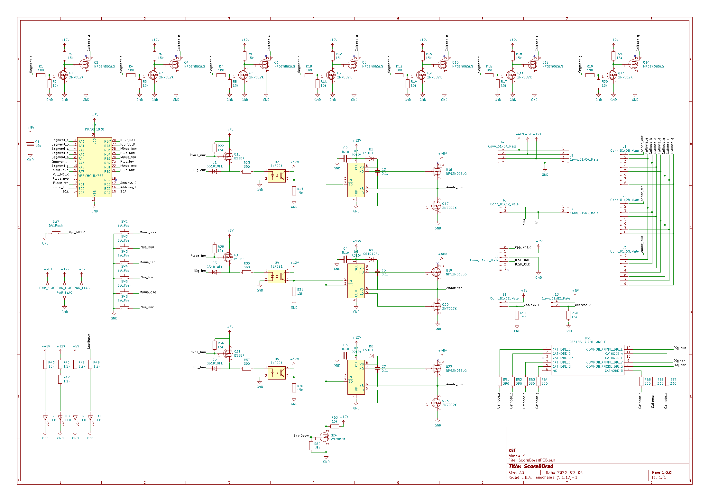
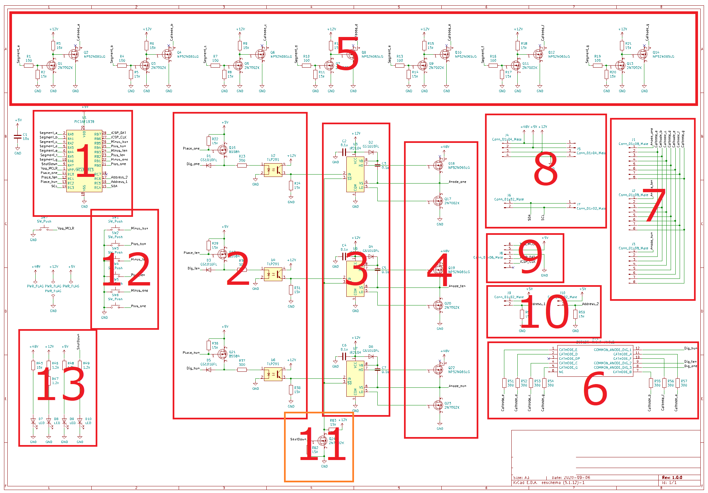

# 詳細資料
## 回路図
**詳細は[元ファイル](PCB//ScoreBoradPCB/ScoreBoradPCB.pro)を参照してください。**

### 1.マイコン16F1938

### 2.アノード制御部

1. PchFETで生成された５Vアノード側信号を7セグメントLEDのアノード側に送ります。**D1**は7セグ側からの逆流防止用ダイオードです。
2. PchFETです。マイコンからの電流出力では7セグLEDなどを駆動するのに電流が不足するのでFETを介しています。Pchなので論理が反転することに注意してください。
3. フォトカプラです。マイコン側からの信号を+48V側と電気的に切断するのと、ゲートドライバ入力用の+12Vを生成する目的があります。

### 3.ゲートドライバ

1. ゲートドライバIC**IR2104**です。ハイサイドドライブ用電源の確保と各FETのデッドタイム制御を行います。**IN**がゲート信号入力端子で、**SD**はシャットダウン信号入力端子で負論理です。
2. IC電源安定ようコンデンサ
3. ブートストラップダイオード
4. ブートストラップコンデンサです。ゲートドライバ回路自身より高い電圧のFETのゲートを制御するためにコンデンサに充電した電力を用います。

### 4.LEDアノード側制御部

1. アノード制御ハイサイドFET**NP52N06SLG**です。LED用電源を制御してLEDパネルのアノード側へ電源を供給します。
2. アノード制御ローサイドFET**2N7002K**です。LEDアノード電圧を**GND**に落とし、ブートストラップコンデンサを充電します。

* 以上の**2.**から**4.**までの回路を1セットとして**1の位**、**10の位**、**100の位**をそれぞれ制御しています。

### 5.カソード側制御部

1. **Segment_a**はPICマイコンからの制御信号です。
2. **Q1**は**Q2**を+12VでドライブするためのゲートドライバFETです。
3. **Cathode_a**はLEDカソード側からの端子です。
4. **Q2**はLEDカソード制御用FETです。このFETでLEDのカソード側をGNDに落とすことで回路を形成します。

* この回路を1セットとして**a**から**g**までの7セットで7セグメントとしています。

### 6.7セグメントLED

1. カソード側制御部の**a**~**g**にそれぞれつながっています。
2. 電流制限用抵抗です。
3. アノードコモン7セグメントLEDです。
4. アノード制御部の**Dig_one**、**Dig_ten**、**Dig_hun**にそれぞれつながっています。

### 7.LEDパネル用コネクタ
* 3枚のLEDパネルへ接続します。

### 8.電源・通信用コネクタ
* 基板4枚を数珠繋ぎにするためにコネクタは各2つずつあります。
* 上の4本の回路が電源用で、下の2本の回路が通信用です。

### 9.PIC書き込み端子
* PICマイコンへプログラムを書き込む際に使用します。

### 10.アドレス選択用端子
* ジャンパピンでショートさせることで基板のアドレスを選択します

### 11.シャットダウン回路
* ゲートドライバICの**SD**端子を**GND**に落とすことでアノード側の電源を遮断します。LEDパネルの消灯制御に使用しています。

### 12.操作用ボタン
* 計6このボタンをプルアップされたマイコンの入力端子に接続しています。

### 13.状態表示LED
* +48V,+12V.+5V,SDの状態をLEDで表示します。